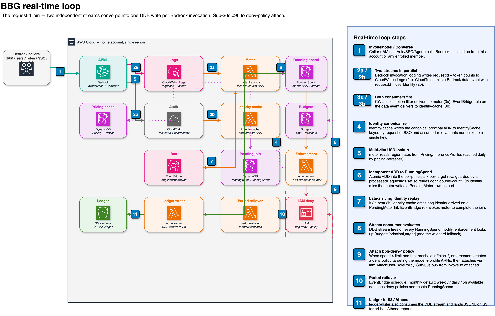

# Architecture

## Diagrams in this repo

| File | Purpose |
|---|---|
| [`architecture.png`](architecture.png) ([source](architecture.drawio)) | Wide system view — all services, multi-region + multi-account topology, 16-step data-flow legend |
| [`architecture-realtime-loop.png`](architecture-realtime-loop.png) ([source](architecture-realtime-loop.drawio)) | Focused view of the requestId join — how two independent streams converge into one DDB write per Bedrock invocation |

Both PNGs are regenerated from `.drawio` source via the `aws-architecture-diagram` skill (see "Regenerate" below). Edit the `.drawio` file in draw.io desktop or via the skill, then re-export the PNG with `drawio --export --format png --scale 2 docs/<name>.drawio`.

## Service-level overview


Source-of-truth for this PNG is [`architecture.drawio`](architecture.drawio) — an editable draw.io XML file generated by the `aws-architecture-diagram` agent skill from the [`awslabs/agent-plugins`](https://github.com/awslabs/agent-plugins) `deploy-on-aws` plugin. The skill produces validated XML using official AWS4 icon shapes, with adaptive light/dark styling and `light-dark()` CSS so the diagram renders correctly in either mode.

Regenerate after structural changes:

```bash
# One-time: install the deploy-on-aws Claude Code plugin
claude plugin marketplace add awslabs/agent-plugins
claude plugin install deploy-on-aws

# Then ask the skill to scan the codebase and update the diagram
claude /aws-architecture-diagram analyze
```

Open `architecture.drawio` in [draw.io desktop](https://www.drawio.com/) (or [diagrams.net](https://app.diagrams.net/)) to edit the diagram directly. Re-export PNG via the draw.io desktop CLI (`drawio --export --format png --scale 2 docs/architecture.drawio`) so the README PNG stays in sync with the source.

The earlier `architecture.py` (Python `diagrams` library) was retired in favor of this skill — the skill produces editable XML with AWS Reference Architecture styling rather than a static raster.

## Real-time loop (logical flow)

Below is the same system viewed as the request-id join across two independent streams. The near real-time enforcement loop is what makes BBG sub-30-second instead of CUR's 8–24 hour cadence.



Source-of-truth: [`architecture-realtime-loop.drawio`](architecture-realtime-loop.drawio). Same regeneration flow as the wide architecture above.

## Real-time loop

End-to-end p95 target: **< 30 seconds** from `InvokeModel` to a `bbg-deny-*` policy attached to the offending principal.

1. **`InvokeModel` / `Converse` / `InvokeAgent`** is captured by Bedrock model invocation logging (token counts, requestId, modelId, optional inferenceProfileArn) and by CloudTrail, which delivers the call as a management-event API call (userIdentity, same requestId) to the default EventBridge bus. These two streams are independent and arrive in parallel. A trail logging management events is required for that default-bus delivery; BBG creates a minimal multi-region management-events trail by default (opt out with `bbg:createManagementEventsTrail: false` if the account/Org already has one).

2. **`meter` Lambda** consumes the CloudWatch Logs subscription. It reads `IdentityCache[requestId]` for the calling principal. On hit it computes USD cost from `Pricing[modelId].regionRates[callingRegion]`, scales it by `(1 - effectivePct/100)` from the invoking account's custom-discount row (see "Hierarchical custom pricing discounts" below), and atomically `ADD`s the result to `RunningSpend` with an idempotency guard (`processedRequestIds` set). On miss it writes a `PendingMeter` row to wait for identity-cache.

3. **`identity-cache` Lambda** consumes the EventBridge rule matching Bedrock API-call events on the default bus. It canonicalizes `userIdentity` for every supported caller type (IAM user, IAM role, SSO `AWSReservedSSO_*`, Bedrock Agent service role, Federated, AssumedRole). On a `PendingMeter` hit it emits `bbg.identity-arrived` to EventBridge so the meter can complete the join.

4. **`enforcement` Lambda** is a DynamoDB stream consumer on `RunningSpend`. On every modify, it looks up `Budgets[principal, target]` (and the wildcard `Budgets[principal, target=*]`). When `spend ≥ limit` and `action=deny`:
    - Builds a deny policy targeting the foundation-model ARN and any associated inference-profile ARNs. For per-identity (non-ARN) budgets the deny is attached to the issuer role and scoped to the one identity via `aws:userid` (SSO) / `aws:SourceIdentity`, or `aws:PrincipalTag` for a role-keyed budget carrying a `condition`.
    - Creates `bbg-deny-<hash>-<period>` if it doesn't exist (catches `EntityAlreadyExistsException`).
    - Stamps `enforcementPolicyArn` on the spend row with `attribute_not_exists` guard for idempotency.
    - Calls `iam:AttachUserPolicy` or `iam:AttachRolePolicy`. The Lambda's role is scoped via `iam:PolicyARN` ArnEquals condition restricted to `arn:aws:iam::<account>:policy/bbg-deny-*` only.

5. **`period-rollover` Lambda** runs monthly via EventBridge Scheduler. It paginates `RunningSpend.byPeriod` for the prior period, detaches every `bbg-deny-*` policy from every entity that has it attached, deletes the policy, and resets the spend row.

### Second enforcement signal: per-principal RPM / TPM rate limits

USD enforcement catches accumulated spend, but only fires after the offending caller has already burned the configured limit. A runaway agent loop on Claude Opus 4.7 can rack up $100 in a few minutes — by the time USD enforcement fires, the bleed has already happened.

To close that gap, every budget can carry an *additional* rate-limit signal alongside the dollar limit:

- `rpm` — maximum requests per sliding window
- `tpm` — maximum tokens (input + output combined) per sliding window
- `rateWindowSeconds` — sliding window length: `60` (default), `300`, or `900`

The new flow piggybacks on the existing meter → DDB-stream → enforcement loop:

1. **Meter** writes a per-minute counter row to a new `RateCounters` table (PK `principal`, SK `1m#YYYY-MM-DDTHH:MM`, ADDs `requestCount` and `tokenCount`) on every metered event when *any* budget for the principal has rate fields set. A 5-minute in-Lambda cache keeps non-rate-limited deployments zero-overhead.
2. **Enforcement** consults `RateCounters` *before* the USD path on every `RunningSpend` stream event when the matching budget has `rpm`/`tpm`. It BatchGets the K minute-buckets covering the window, sums them, and compares against the limit.
3. The deny primitive is **identical** to the USD path — same `bbg-deny-*` policy, same attach mechanism, same release semantics. The only difference is the `enforcementReason` field stamped on the spend row (`'rpm'` or `'tpm'` instead of `'usd'`) and a `enforcementMetric` snapshot showing what was measured.
4. The notify Lambda branches the email body based on reason — operators see *"42 requests in 60s ≥ limit 20 (likely runaway loop)"* instead of a generic "budget breached" message.

Rate-triggered denies stay attached until the next period rollover OR until an admin releases the budget — same behavior as USD-triggered denies. We do not auto-release because rate breaches usually indicate a runaway loop or leaked credential, both of which deserve human investigation.

## DynamoDB tables

All tables are on-demand, PITR-enabled, and encrypted with the shared data-plane CMK. Defined in [`infra/lib/data-stack.ts`](../infra/lib/data-stack.ts).

| Table | PK / SK | GSI | TTL | Role |
|---|---|---|---|---|
| `Budgets` | `principal` / `target` (`model#<id>` \| `model#*` \| `profile#<arn>` \| `profile#*`) | `byTarget` (`target`, `principal`) | — | Operator-authored limits. Stream (`NEW_AND_OLD_IMAGES`) feeds the opt-in `budgets-action-sync`. |
| `RunningSpend` | `principal` / `sk` = `period#YYYY-MM#target#<id>` | `byPeriod` (`period`, `principal`) | `ttl`, ~13 months of history | The meter's accumulator. Stream feeds `enforcement`, `ledger-writer`, and `notify`. |
| `IdentityCache` | `requestId` | — | `ttl`, 1 hour | The requestId join target written by `identity-cache`. |
| `PendingMeter` | `requestId` | — | `ttl`, 1 hour | Invocations parked waiting for identity to arrive. |
| `Pricing` | `model` | — | — | Per-model `regionRates`, refreshed daily. **Also holds the reserved `discount#*` namespace** — custom-discount rows never collide with a real model row. |
| `InferenceProfiles` | `profileArn` | `byModel` (`modelId`, `profileArn`) | — | CRIS profile → target model/region resolution. |
| `AgentSessions` | `agentSessionId` | — | `ttl`, 7 days | Multi-agent supervisor → collaborator rollup. |
| `PrincipalsSeen` | `principal` | — | `ttl`, lastSeen + 30 days | Directory of distinct callers behind the Identities page's "seen in last X" query. Small (scales with distinct principals, not invocations). |
| `PrincipalActivity` | `principal` / `sk` = `ts#<iso>#<uuid>` | `byDay` — see below | `ttl`, ~1 year | Durable per-principal event timeline. Query with `ScanIndexForward=false` for reverse-chronological order; the uuid suffix disambiguates same-millisecond writes. |
| `RateCounters` | `principal` / `bucket` = `1m#YYYY-MM-DDTHH:MM` | — | `ttl`, bucket-floor + 16 min | Sliding-window `requestCount` / `tokenCount` for RPM/TPM enforcement. 16 min clears the longest 15-min window without mid-query expiry. |
| `PasskeyNicknames` | `userId` / `credentialId` | — | — | Friendly names for WebAuthn credentials (Cognito has no rename API). |

**`PrincipalActivity.byDay`** exists because a `principal` PK can't serve a cross-principal, time-ordered "recent activity across everyone" query for the central `/admin/activity` feed. It partitions by UTC day (`bucket` = `day#YYYY-MM-DD`) with the same time-ordered `sk` as the sort key. The `INCLUDE` projection carries only `ts`, `type`, `summary`, `actor`, and `accountId` — `detail` is excluded on purpose, keeping each projected item ~0.3 KB (~1 WCU); feed rows open a modal that reads the base table for full detail. The index is **sparse**: rows written before `bucket` existed carry no partition key, so the feed fills forward from the first write rather than backfilling.

**`PrincipalActivity` key taxonomy.** The `principal` PK holds one of: `principal#<canonical-arn>` (IAM user/role callers), `principal#sso-user#<email>` / `principal#sourceIdentity#<value>` (the meter's identity-lens rows), or `user#<cognito-username-UUID>` for Cognito user-lifecycle events (created/updated/disabled/enabled/deleted/groups/password-reset). The user-lifecycle key is the **immutable Cognito Username (UUID)**, not the email — email is a mutable, self-writable alias, so keying on it would both split a user's timeline on an email change and expose a write-path leak surface. `user#<email>` rows exist only as legacy history from before that fix and are read (not written) by `/me/activity` until they TTL out. A mapped user's create/update event is also mirrored to their `principal#<arn>` so the admin per-principal view is complete.

## Lambda inventory

| Lambda | Trigger | Responsibility |
|---|---|---|
| `meter` | CWL subscription + `bbg.identity-arrived` + cross-region/account `bbg.bedrock-invocation` events | Multi-dimensional cost compute, discount scaling, `RunningSpend` accumulation. |
| `identity-cache` | EventBridge rule on Bedrock API-call events (default bus) | Canonicalizes `userIdentity` for every caller type; upserts `PrincipalsSeen`. |
| `enforcement` | `RunningSpend` DDB stream | USD + RPM/TPM evaluation; creates and attaches `bbg-deny-*` (cross-account aware). |
| `period-rollover` | EventBridge Scheduler (monthly / weekly / daily / 5h) + on-demand invoke | Detaches and deletes deny policies; resets spend rows. |
| `notify` | `RunningSpend` DDB stream | SES threshold + enforcement emails. Routes identity-lens rows to the SSO user's own address; falls back to `bbg:notifyOpsFallbackAddress` for principals with no mapped human. |
| `ledger-writer` | `RunningSpend` DDB stream | Appends JSONL to the S3 ledger for Athena. |
| `pricing-refresher` | EventBridge Scheduler, `cron(0 3 * * ? *)` | AWS Pricing API → `Pricing` table across three Bedrock service codes. |
| `org-discount-resolver` | EventBridge Scheduler, `cron(20 * * * ? *)` (hourly at :20) **+ on-write** from the pricing-overrides API | Walks the AWS Organizations tree and materializes the winning `effectivePct` onto each `discount#<accountId>` row. Degrades to a **no-op** when Organizations is denied (BBG not in the management account) — logs, emits `OrgDiscountResolverDegraded`, and touches no row. |
| `inference-profile-refresher` | EventBridge Scheduler (daily) | Walks `bedrock:ListInferenceProfiles`. |
| `cur-reconciler` | EventBridge Scheduler (daily) | Athena: CUR 2.0 vs. the meter's invocation ledger, both watermarked to bill-complete days; alarms on drift. |
| `cwl-forwarder` | CWL subscription in non-home metered regions | Ships invocation events to the home-region default event bus. |
| `pre-token-gen` | Cognito V2 trigger | Emits the `bbg:scope` claim. |
| `budgets-action-sync` | `Budgets` DDB stream (opt-in) | Mirrors rows to native AWS Budgets + Budget Actions. |
| `gateway` | API GW route (opt-in, default off) | `sts:SetSourceIdentity` + transitive-tag attribution proxy. |

## Hierarchical custom pricing discounts

Negotiated Bedrock rates rarely apply uniformly across an Organization, so a discount % can be authored at three scopes — all stored in the `Pricing` table under the reserved `discount#` namespace so the existing overrides-exclusion filter and refresher scans keep working unchanged:

| Scope | Key shape |
|---|---|
| account | `discount#<12-digit accountId>` |
| OU (any depth; the org root `r-…` is just an OU) | `discount#ou#<ou-id>` |
| org-wide | `discount#org#<org-id>` |

**Precedence — most specific wins, single winner, no multiplicative stacking:**

1. **account** — an explicit `discount#<acct>` row.
2. **nearest OU** — walk the account's OU path **deepest-first** (immediate parent upward).
3. **org root as an OU** — the root id is the first element of the OU path, so it falls out naturally as the last OU checked in step 2.
4. **org-wide** — `discount#org#<org-id>`.
5. **none** — list price.

An account row with `discountPct: 0` is an **explicit exclusion**: "meter this account at list price, ignoring any OU/org discount it would otherwise inherit." It wins on specificity *and* short-circuits inheritance before the OU/org fallthrough — the only way to opt one account out of an inherited rate. The resolver never materializes an `effectivePct` onto an excluded account, so no inherited rate can override the exclusion.

Precedence is resolved **off the hot path**. The `org-discount-resolver` walks the Organizations tree and writes the winning percentage (plus provenance: `effectiveScope`, `effectiveScopeId`, `effectiveResolvedAt`) onto each account's `discount#<accountId>` row. The meter therefore does exactly one cached `GetItem` (5-min TTL) and prefers `effectivePct` over the account's own authored `discountPct` — the fallback path that keeps account-scoped discounts working on installs where the resolver has never run, or where BBG isn't deployed in the management account.

## Coverage matrix: caller types

The meter and enforcement work transparently for every Bedrock-callable identity. No SDK shims, no proxy required.

| Caller pattern | Canonical `principal` key | Enforcement |
|---|---|---|
| **IAM user** | `principal#arn:aws:iam::ACCT:user/<name>` | `iam:AttachUserPolicy bbg-deny-*` |
| **IAM role** (incl. EC2 instance profile, Lambda exec role, dev assume-role) | `principal#arn:aws:iam::ACCT:role/<name>` (canonicalized via `sessionIssuer.arn`) | `iam:AttachRolePolicy bbg-deny-*` |
| **IAM Identity Center (SSO)** | Two parallel keys: `principal#arn:aws:iam::ACCT:role/aws-reserved/.../AWSReservedSSO_<PermSet>_<hash>` AND `principal#sso-user#<email>` | Attach to the SSO reserved role; resilient to permission-set hash rotation |
| **Federated SAML/OIDC** | `principal#sso-user#<email>` / `principal#sourceIdentity#<value>` (auto-enforce) or role-keyed + `condition` or `sessionTag/<k>=<v>` (gateway only) | Deny attached to the issuer role, scoped to the one identity via `aws:userid` / `aws:SourceIdentity` (or `aws:PrincipalTag` for role+condition). `unknown` / GetFederationToken → alert-only (`EnforcementUnattachable`) |
| **Bedrock Agent (single)** | `principal#agent-role#<roleArn>` | Deny on the agent's service role |
| **Bedrock Agent (multi-agent)** | Per-collaborator service role + per-`agentSessionId` rollup | Deny on supervisor or specific collaborator role |

## Optional gateway (attribution aid, default off)

For teams that want to attribute spend to *humans* even when the underlying caller is a shared agent service role, an opt-in `gateway` Lambda + API GW route assumes a dedicated role with **transitive session tags** + `sts:SetSourceIdentity` before invoking Bedrock. CloudTrail then carries the human identity through the agent chain, and identity-cache rolls spend up to that human via session-tag-keyed `principal` rows.

The gateway never replaces the meter — direct callers continue to be metered identically. It just enables finer attribution.

## Why not CUR 2.0 + AWS Budgets for enforcement?

CUR 2.0 IAM-principal cost allocation and AWS Budget Actions are valuable, but their refresh cadences make them unsuitable as the *primary* shutoff:

| Channel | Detection latency |
|---|---|
| CUR 2.0 line items | 8–24 hours |
| Cost Explorer | up to ~24 hours |
| AWS Budgets evaluation | sub-daily |
| AWS Budget Actions | fires after Budgets evaluates |

A misbehaving caller can spend $10k+ on a frontier model in an afternoon. The real-time meter stops the bleed in seconds; CUR 2.0 closes the books later as the auditor (the `cur-reconciler` Lambda compares totals daily and alarms on drift).
